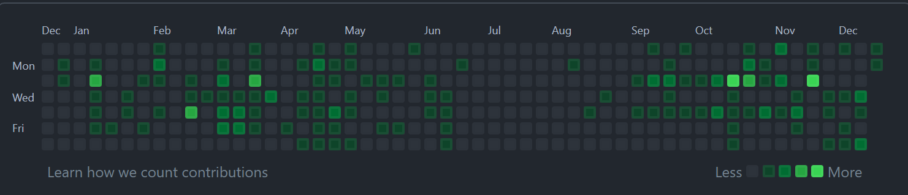
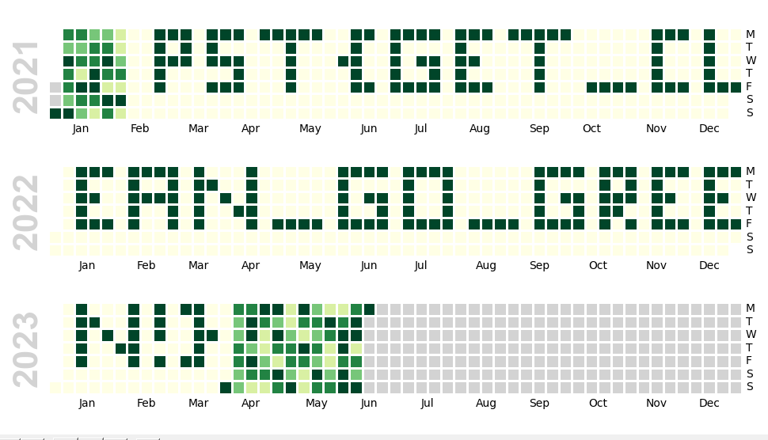
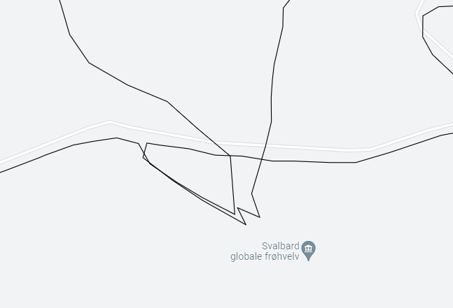

# npst 2021

## Innhold

- [1. Velkommen](#1-velkommen)
- [2. Huskelapp](#2-huskelapp)
- [3. Julekort](#3-julekort)
- [4. Verkstedkrøll](#4-verkstedkrøll)
- [5. Digivarelager](#5-digivarelager)
- [7. Kryptert melding](#7-kryptert-melding)
- [8. Frimerke](#8-frimerke)
- [9. Nettverkstrafikk](#9-nettverkstrafikk)
- [10. Digivarelager v2](#10-digivarelager-v2)
    - [10. Egg](#10-egg)
- [11. Filsystem](#11-filsystem)
- [12. Ugler i grøten](#12-ugler-i-grøten)
    - [12. Egg](#12-egg)
- [14. Reinsdyr på villspor](#14-reinsdyr-på-villspor)
    - [14. Egg](#14-egg)
- [15. Kameraopptak](#15-kameraopptak)
- [16. Ødelagt Julesang](#16-ødelagt-julesang)
- [17. Klokt trasèvalg](#17-klokt-trasèvalg)
- [18. Grønne bokser](#18-grønne-bokser)
- [19. Chimneyhopper](#19-chimneyhopper)
- [21. Mulig lekkasje](#21-mulig-lekasje)
- [22. Mistenkelig rute](#22-mistenkelig-rute)
- [23. Sabotasje](#23-sabotasje)
    - [23. Egg](#23-egg)
- [24. Ukjent](#24-ukjent)

## 1. Velkommen

### 1. Oppgave

```ascii
Veldig hyggelig å ha deg ombord og fint å se at du har funnet veien inn til DASS. For at du skal finne deg mer til rette anbefaler jeg deg å sette ditt eget preg på systemet! Dette kan du gjøre ved å velge «Mal» fra startmenyen, mal din egen skrivebordsbakgrunn og velg Fil -> Sett som skrivebordsbakgrunn. Her er det bare kreativiteten som setter begrensninger, men i tilfelle du trenger litt starthjelp, legger jeg ved et eksempelbilde.
```


### 1. Løsning

- [aperisolve.fr](https://aperisolve.fr/)

> PST{HelloDASS}

## 2. Huskelapp

### 2. Oppgave

```ascii
Vi går rett på sak. I fjor rakk ikke julenissen å dele ut pakker til alle som hadde gjort seg fortjent. For å komme til bunns i årsaken ble det satt ned et utvalg med mandat til å utnevne en kommisjon som skulle starte arbeidet med opprettelsen av en granskningskommité. Da granskningskommiteen kom med sin utredelse viste det seg at mulighetsrommet for å utøve slemme handlinger ble betraktelig redusert ved nedstenging og isolasjon. Det hadde rett og slett blitt for mange snille barn.

Da nedstenging og isolasjon delvis har vedvart, har det høy prioritet i år å finne en ny, mer optimal rute.

Julenissen fant i går en huskelapp som han tror kan være relevant, men han klarer ikke å finne ut av hva han skulle huske. Kunne du hjulpet han med det?
```

### 2. Løsning

> PST{mangesnillebarniverden}

## 3. Julekort

### 3. Oppgave

```ascii
God fredag. Det Nordpolare Postkontor har oppdaget et julekort som er på vei til Antarktis. Etterretning viser at pingvinene i Antarktis ikke alltid har ren snø i skuffa. Det er derfor ønskelig at en alvebetjent gjennomfører en rutinemessig kontroll, og undersøker julekortets bakside og framside. Rapporter tilbake et eventuelt funn innpakket i pst{}.
```

### 3. Løsning

> pst{JULENISSENERTEIT}

## 4. Verkstedkrøll

### 4. Oppgave

```ascii
HMS-ansvarlig var innom verkstedet i går og var helt forskrekket over rotet vi har etterlatt oss der. Jeg er litt opptatt med møter i dag, kan du ta deg tid til å rydde litt? Oversikt over hva vi har på verkstedet ligger vedlagt.
```

### 4. Løsning

> pst{detblirfortrot}

## 5. Digivarelager

### 5. Oppgave

```ascii
NPST har digitalisert varelageret sitt og flyttet det til skyen! For øyeblikket er det fortsatt i oppstartsfasen og trenger litt kvalitetssjekking.

Har du mulighet til å se om Varelager v1 funker som det skal og at det ikke skjuler seg noen feil i systemet?

Varelageret finner du her, og bruk programmeringsgrensesnittnøkkel v1_pgmsqxmddz.
```

### 5. Løsning

> PST{5Q1_1nj€Ⓒt10n}

## 7. Kryptert melding

### 7. Oppgave

```ascii
Godt å se at du er klar for en ny arbeidsuke! Arbeidsoppgavene står i kø, så det er best å sette i gang umiddelbart:

Det er fanget opp en kryptert melding som Etterretningsalvdelingen har grunn til å tro at inneholder noe av interesse. Meldingen skiller seg ut fordi det ser ut til at mottaker er lokalisert i sydpolare strøk. For andre gang på under en uke! E-alvene er temmelig overbevist om at det er brukt temmelig sikker krypto her, fordi de ikke klarer å knekke meldingen. Og det sier litt, siden e-alvene våre er eksperter på knekking.

Uansett, kan du ta en titt? E-alvene mener det er en umulig oppgave siden de ikke klarer det, men jeg håper at du kanskje har litt nyansattflaks.

Her er meldingen:

Y2MPyYU4kblEXrEfExry4AIRAjqdke+JyQQN50Uj5GuCu5rE66lEzQXB5bE VOlNGRoU06Ny4vh/gzSPFV0mHUrxaaAVt1BwN1WN1HFT7baIejtR5KyG6 JK8yC70CpuPZV610coCiWzdFICcgEtAdQaesScLrg495kxofzG3EGvA=
```

### Hint 1

```ascii
Etterretningsalvdelingen informerer om at mottaker av den krypterte meldingen heter Chili Willy. Kanskje det kan være til hjelp for å dekryptere meldingen?
```

### Hint 2

```ascii
en Alvebetjent gjorde meg oppmerksom på at det kan ha foregått En nøkkelutveksling tidligere i desember, kanSkje det kan hjelpe i oppklaringen?
```

### 7. Løsning

> pst{nootnoot}

## 8. Frimerke

### 8. Oppgave

```ascii
En av alvebetjentene fant et løst frimerke i postmottaket. Initielle undersøkelser viser at det ikke kan ha sittet på julekortet som kom den 3. desember, da fiberne som sitter igjen i limet ikke er av samme type som julekortet. Fiberne kan minne om setetrekket fra en reinsdyrslede klasse 8.

Motivet på frimerket er av en slik karakter at det må undersøkes nærmere. Kan du ta en titt?
```

### 8. Løsning

> PST{R3m3mb3r_m3?_W3_h4d_SO_MUCH_FUN_t0g3th3r!_:D}

## 9. Nettverkstrafikk

### 9. Oppgave

```ascii
Fikk tilsendt denne filen fra IT-avdelingen i går, de har TAPpet filen ut av nettverket. Har du mulighet til å se på den? Mulig den gir oss litt mer informasjon angående lekkasjen vi hadde ut til SPST. Husk, dette forblir mellom oss, i tilfelle det viser seg å være en av våre egne.
```

### 9. Løsning

> pst{jegsnakkermeddegfrastue}

## 10. Digivarelager v2

### 10. Oppgave

```ascii
Fikk tilsendt denne filen fra IT-avdelingen i går, de har TAPpet filen ut av nettverket. Har du mulighet til å se på den? Mulig den gir oss litt mer informasjon angående lekkasjen vi hadde ut til SPST. Husk, dette forblir mellom oss, i tilfelle det viser seg å være en av våre egne.
```

### 10. Løsning

> PST{c3ce11494e56a8897b6f80d1ca3dbe}

### 10. Egg

> PST{EGG_StRpiITbqyEsBJM}

## 11. Filsystem

### 11. Oppgave

```ascii
En av terminalene på julenissens kontor har utvist rar oppførsel de siste dagene. AlveCERT har sikret data fra hjemmeområdet, finner du noe muffens?
```

### 11. Løsning

> PST{JuleLama}

## 12. Ugler i grøten

### 12. Oppgave

```ascii
God søndag! Det er fanget opp tO krypterte meldinger som ble sendt under lunsjgrøTen i dag. Det vekker mistanke, siden alle alvebetjenter elsker grøt og aldri vil gå gliPp av en lunsjgrøt. Se de krypterte meldingene nederst i mailen. En dyktig alvebetjent har allerede funnet noen biter av klarteksten til melding 1:

"- - - k r o e l l - - - - - - - - - - - - - - - - - - - - - - - k r o e l l - - - - - - - -"

og noen biter av klarteksten til melding 2:

"- - - - - - - - - - - - - - - - p e n g w y n - - a - - o l - n - - - - - - - - - - - - - -"

Kan du se om du klarer å finne resten av klarteksten til begge meldingene? Legger også ved en tabell over ascii-verdier, kanskje du får bruk for den.

Melding 1:

00010101 00010100 00010011 00000000 00011101 00000011 00001010 00000010 00011100 00000011 00010101 00011001 00010111 00000001 00010001 00001001 00011111 00010010 00000100 00000000 00001001 00000111 00011010 00000000 00000001 00001110 00000000 00010101 00001011 00011111 00010000 00011000 00000000 00000000 00000000 00000000 00000000 00000000 00000000 00000000 00000000 00000000 00000000 00000000 00000000 00000000

Melding 2:

00010110 00001100 00000110 00000111 00001000 00000101 00001101 00001011 00000011 00011000 00011110 00001110 00010110 00001001 00010111 00001101 00011100 00010101 00001111 00010101 00010010 00010111 00011010 00001010 00011110 00000100 00000110 00000111 00001010 00000000 00010000 00000100 00011000 00011001 00000110 00001011 00000010 00001001 00000010 00001000 00011111 00001010 00011100 00010011 00000000 00011101
```

### 12. Løsning

> pst{berlinerkranser}

### 12. Egg

> pst{erteluj}

## 14. Reinsdyr på villspor

### 14. Oppgave

```ascii
Fire av Julenissens favorittreinsdyr ble sluppet løs fra basen på Svalbard i går. Heldigvis er det sporing på reinsdyrene, så en av alvene i NPST har funnet en datamaskin og lastet ned sporingsdataen. Han klarer dessverre ikke å finne ut hvordan man får tak i GPS-filene.

Kan du hjelpe han?

Nb: Hvis du skulle finne noe mistenkelig i dataen, så rapporter tilbake med hva du fant, omkranset av PST{ og }.
```

### 14. Løsning

> PST{RUNFORESTRUN}

### 14. Egg

> PST{Egg_RudolfErRoedPaaNesen}

## 15. Kameraopptak

### 15. Oppgave

```ascii
Etter gårsdagens reinsdyrflukt bestemmer alvebetjent M. Nist seg for å sjekke kameraloggen. Dessverre ser det ut som om det bare eR blått og grØnt støy Der... Klarer du å finne ut noe mer fra opptaket?
```

### 15. Løsning

> pst{hervardetikkemyeåsegitt...}

## 16. Ødelagt Julesang

### 16. Oppgave

```ascii
Alvene på verkstedet klager over dårlig kvalitet på noen av julesangene som spilles over høyttalerne. Særlig denne sangen, "Rudolph, the Red-Nosed Reindeer", har mottatt mange klager. Kan du se om du finner ut hva som er galt?

Det spilles et bredt spekter av julesanger på verkstedet, men denne sangen er egentlig en favoritt blant alvene. Da er det jo ekstra synd at lydkvaliteten er dårlig.
```

### 16. Løsning

> pst{h4kkipl4pl4t4}

## 17. Klokt trasèvalg

### 17. Oppgave

```ascii
Hei,

nå Er det jo baRe en uke igjen til jul så vi må begynne å få på plass den nye pakkefordelingSruta. avdelingen for optimalisering og ruteplanlegging har jobbet hardt med å finne en trasé, og ga meg i går en Cd Hvor den foreløpige ruten er lagrEt. de fortalte meg at de hadde en baktanke med trasén, men ville ikke fortelle meg høyt hva dette var (i frykt for avlytting), så dette skulle komme frem fra fiLen. jeG sliteR med å tolke hvA de har tenkt. kunne du hjulPet meg?

mvH mellomleder
```

### 17. Løsning

> pst{skyrival}

## 18. Grønne bokser

### 18. Oppgave

```ascii
Alvdelingen for nettverksoperasjoner har utført en hemmelig nettverksoperasjon mot SPST. De har snublet over et "git repository", men de synes det er noe merksnodig med det. Alv en eller annen grunn så mener Alvdelingen for tekniske undersøkelser at det kan ha noe med "grønne firkanter" å gjøre, hva nå enn det betyr.

Om du trenger hjelp så kunne du kanskje spurt alvdelingen for åpne kilder - de tar sikkert en titt på Github profilen til personen som "comitter" i repoet, kanskje det ligger et hint der.
```

### 18. Løsning

Etter å ha lest oppgaven, og tatt til meg ordene fikk jeg en ide om at man de snakket om contribution grafen på github profilen.



Vi fikk kun utdelt, en .git fil, og kjørte først en git log for å se om noe lå umiddelbart der. Der så vi at *Underleder* hadde hatt de siste commitsene til repoet. I oppgaveteksten sto det noe om hithub profilen til den som commiter, så jeg bestemte meg for å sjekke ut profilen til Underleder. Der fant jeg fort:


Altså jeg hadde tenkt rett. Den første ideen jeg fikk var å hente ut alle commitsene fra .git filen, å plotte de på samme måte som github. Fant ut at det var et bibliotek som het gitpython, hvor jeg kunne gjøre dette lett.

Scriptet under henter ut alle commitsene fra .git filen, teller antall på samme dag, og putter det i en json fil.

```python
from git import Repo
import time
import json

repo = Repo("./groenne-firkanter")
tree = repo.tree()
headCommit = repo.head.commit

commits = []
while True:
    nParents = len(headCommit.parents)
    commitTime = time.strftime("%a, %d %b %Y %H:%M", time.gmtime(headCommit.committed_date))
    
    commits.append({"commit": headCommit, "time": commitTime})
    
    if (nParents == 0):
        break

    headCommit = headCommit.parents[0]

distinctDates = []
for commit in commits:
    if (commit["time"] in distinctDates):
        continue
    else:
        distinctDates.append(commit["time"])

countedDates = []

for dates in distinctDates:
    countedDates.append({"date": dates, "count": 1})

for commit in commits:
    for date in countedDates:
        if (date["date"] == commit["time"]):
            date["count"] += 1


with open("dates.json", 'w') as outfile:
    json.dump(countedDates, outfile)

```

Da hadde jeg dataen jeg trengte, og måtte finne en måte å plotte det på. Tidligere har jeg mye brukt en javascript canvas bibliotek som heter p5, så bestemte meg for å bruke det.

```javascript
let data;
function preload() {
  data = loadJSON("./dates.json");
 
}
MONTHS = ['January', 'February', 'March', 'April', 'May', 'June', 'July', 'August', 'September', 'October', 'November', 'December'];

DAYS = ['Sunday', 'Monday', 'Tuesday', 'Wednesday', 'Thursday', 'Friday', 'Saturday'];
DAYSINMONTHS = [31, 28, 31, 30, 31, 30, 31, 31, 30, 31, 30, 31];

YEAR = 2021

function setup() {
 createCanvas(520*3, 70);

 for (var i = 0; i < data.length; i++) {
  data[i].date = new Date(data[i].date);
 }
 print(data)

 counter = 0
 currentMonth = 0
 for (var x = 0; x < width; x += width / (52 * 3)) {
  for (var y = 0; y < height; y += height / 7) {
   counter++
   if (counter > DAYSINMONTHS[currentMonth]) {
    counter = 0
    currentMonth++
   }

   currentDay = DAYS[y]
   currentDate = new Date(YEAR, currentMonth, counter )
   
   let fillVal = 0
   for (var i = 0; i < data.length; i++) {
    if (data[i].date.getDate() == currentDate.getDate() && data[i].date.getMonth() == currentDate.getMonth() && data[i].date.getFullYear() == currentDate.getFullYear()) {
     fillVal = data[i].count
     break
    }
   }
   
   stroke(0);
   strokeWeight(1);
   fill(0, 50 * fillVal, 0);
   rect(x, y, width / 52, height / 7);
  }
 }
}

function draw() {
}

```

Resultatet av det ble


Hvor resultatet ble noe ødelagt, grunnet forferdelig kode, men greide fortsatt å tyde flagget. Fant senere ut at av en annen at man bare kunne bruke calmap.calendarplot for python. Noe som kunne spart meg mye tid :)



>pst{get_clean_go_green!

## 19. Chimneyhopper

### 19. Oppgave

```ascii
Nissen forsøker å være mer produktiv i år, og unngå å gå ned i feil pipe. For å sørge for spe-serialisert levering har alvene ordnet en helt ny leveransemetode for denne pakkeleveringen.

Nå handler det bare om å finne riktig pipe! Og hva var det han ønsket seg igjen...?
```

### 19. Løsning

I denne oppgaven fikk vi to .ps1 filer scripts. Etter et raskt google-søk viste det seg å være powershell-scripts. Etter det prøvde jeg å kjøre scriptsene, og viste seg å være en en slags klient og server modell, hvor hver av scriptsene snakket med hverandre gjenom pipes. På server-siden kunne man se i koden at den skulle mota en "adresse" fra klienten som dermed skulle dekyptere flagget.

Vi fikk hint som "pid", "hva ønsker julenissen seg", men ingenting løsnet umiddelbart. Etter å ha sett litt nøyere på koden, så det ut som at man kune trengte å sende en int32 over til serveren, og bestemte meg for å prøve å bruteforce løsningen. Jeg lagde et script, basert to server-koden, men fjernet helt tunellen da det var treig, og prøve alle tall mellom 0 og 10000000.

```powershell
$Encrypted_Flag = "76492d1116743f0423413b16050a5345MgB8AGUAbwBRAEwAWQB1ADIARQB5AEEAZgB2AHIAWAB4ADQAdgA5AHIAQwBZAEEAPQA9AHwANQAxAGUAZQAxAGUAMABhADUAOAAwADMAZgBlADkAZQA3ADMANQA4AGIAZAAzADAAYQA5ADYANQA4ADMAZABhAGEAOABmADgANQAxADAANAAwADMAMwA5ADk
AYQA4AGIAMABkAGQAMgA0ADIANgAyAGEAZgBkADUAZgBjADAAZQBhADAAMAAxADkAZQA0ADMAMwBkADIAMQA5ADIAMgA0ADcAMgA2AGUANABlAGQAYQBkAGYAYQA3ADQANAA5ADgA"

$ErrorActionPreference = "SilentlyContinue"
write-host "Starter..."     
for ($i = 0; $i -lt 10000000; $i++) {

    if ($i % 1000 -eq 0) {
        Write-Host $i
    }
    $addressLookup = (Get-FileHash -InputStream ([IO.MemoryStream]::new([byte[]][char[]]$i.ToString())) -Algorithm SHA384).hash
    try {
        $key = [byte[]]($addressLookup[0..15] -join "").ToCharArray()
        $ss = ConvertTo-SecureString -String $Encrypted_Flag -Key $key
        $way = [System.Runtime.InteropServices.Marshal]::SecureStringToGlobalAllocUnicode($ss)
        $decoded = [System.Runtime.InteropServices.Marshal]::PtrToStringUni($way)
        Write-Host "Korrekt adresse funnet! Deploy julegaver " -ForegroundColor Magenta
        Write-Host $decoded -ForegroundColor Yellow
        break
    }
    catch {
        continue
    }
}
```

Riktig tall var 19560, og flagget ble printet

>PST{Nissen_i_pipa}

## 21. Mulig lekasje

### 21. Oppgave

```ascii
NPST's sikkerhetssystemer er satt til øverste beredskap nå som jula nærmer seg, og den ene alvebetjenten oppdaget en melding som noen prøver å skjule. Kan du ta en nærmere titt på denne?
```

### 21. Løsning

> PST{ReadingBetweenTheLetters}

## 22. Mistenkelig rute

### 22. Oppgave

```ascii
Som du sikkert er klar over har de ansatte hos oss mulighet til å trene to timer i arbeidstiden i løpet av uken. Dette er et tilbud mange benytter seg av, spesielt etter at vi startet med utlån av GPS klokker til alle ansatte. De mest ivrige tar tar også med seg klokkene hjem i helgene. Ofte er dette ansatte med stor glede av sosiale medier, som liker å dele opplevelser med andre. Vi har spesielt lagt merke til et økt bruk av Instagram i arbeidstid.

Da en oppmerksom alvebetjent tok imot en klokke i går, fant hun en rute hun syns var veldig mistenkelig og rapporterte den inn. Det mistenktes at personen som lånte denne klokka kan ha hatt kontakt med en pingvin vi holder ekstra øye med. Legger ved både rute som ble funnet på klokka og nylige bevegelser gjort av pingvinen. Kan du ta en tit å se om det har skjedd noe mistenkelig?
```

### 22. Løsning

Det første jeg gjorde var å laste opp begge kml filene til google maps, slik at jeg kunne se de sammen. Så ganske raskt at rutene kun krasjet et sted; "Svalbard seed vault". Jeg prøvde å lete litt i kml filene etter hint videre, før jeg kom på at instagram var nevnt i oppgaveteksten.



Søkte derfor på "svalbard seed vault" på instagram hvor jeg fant en konto som het *chiliwilly1234*, og hadde flagget i bioen til konto.

> pst{utpaaturaldrisur123}

## 23. Sabotasje

### 23. Oppgave

```ascii
Alvene i sledegarasjen rapporterer om at noen har tuklet med julegaveruta som er lagt inn i slede-GPSen. Det er kritisk fordi det ikke er mulig å overstyre sledens GPS-kurs under flyturen. Det har visst blitt lagt til et stopp på Antarktis, rett utenfor SPST sitt hovedkvarter, og jeg (Julenissen) er redd for at SPST planlegger å rappe alle gavene fra sleden på selveste julaften.

I slede-GPS-loggen er det lagt igjen en kort beskjed: "Ikke god jul, hilsen M".

Det er derfor høy prioritet å finne ut hvem "M" er, før "M" klarer å utrette mer ugagn. Mellomleder har skrytt av din innsats denne førjulstiden, så jeg vil derfor betro denne viktige oppgaven til nettopp deg. Jeg personlig har ikke tid, for jeg skal først på gløggsmaking og så skal jeg se Grevinnen og Hovmesteren. Du blir gitt tilgang til kontoret mitt i kveld for å lete gjennom papirer og se om du klarer å finne ut hvem rakkeren er. Navnet rapporteres tilbake til meg (du må selv pakke navnet inn i formatet pst{}).

Dette oppdraget er gradert "Temmelig Hemmelig", så ikke fortell om dine funn til noen andre enn meg personlig.
```

### 23. Løsning

> pst{Maximilian}

### 23. Egg

> ukjent

## 24. Ukjent

### 24. Oppgave

### 24. Løsning

> ukjent
